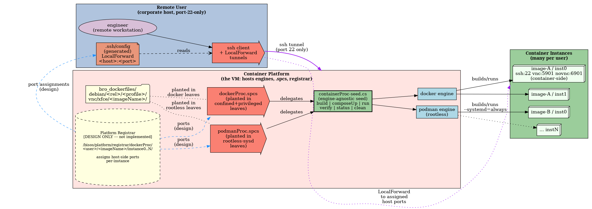

#+title: bisos.dockerProc: Docker/Podman container image lifecycle via Spread Planted Command Services
#+DATE: <2026-08-11 Tue>
#+AUTHOR: Mohsen BANAN
#+OPTIONS: toc:4

#+BEGIN: b:org:pypi:readme/topControls :pkgName "dockerProc" :comment "basic"

|----------------------+------------------------------------------------------------------|
| ~Blee Panel Controls~: | [[elisp:(show-all)][Show-All]] : [[elisp:(org-shifttab)][Overview]] : [[elisp:(progn (org-shifttab) (org-content))][Content]] : [[elisp:(delete-other-windows)][(1)]] : [[elisp:(progn (save-buffer) (kill-buffer))][S&Q]] : [[elisp:(save-buffer)][Save]]  : [[elisp:(kill-buffer)][Quit]]  : [[elisp:(bury-buffer)][Bury]] |
| ~Panel Links~:         | [[file:./py3/panels/bisos.dockerProc/_nodeBase_/fullUsagePanel-en.org][Repo Blee Panel]] --  [[file:/bisos/git/auth/bxRepos/bisos-pip/dockerProc/py3/panels/bisos.dockerProc/_nodeBase_/fullUsagePanel-en.org][Blee Panel]]                                   |
| ~See Also~:            | [[https://pypi.org/project/bisos.dockerProc][At PYPI]] : [[https://github.com/bisos-pip/pycs][bisos.PyCS]]                                             |
|----------------------+------------------------------------------------------------------|

#+END:

* Overview

/bisos.dockerProc/ manages the lifecycle of Docker and Podman container
images via *Spread Planted Command Services* (=.spcs=). The leaf directory
path in a companion image-specifications repo *is* the configuration:
=bisos.dockerProc= parses the leaf path to derive engine (docker vs
podman), init profile (confined / privileged / rootless-sysd), base image,
host-side ports, cgroup variant support, and everything else it needs to
build, run, verify, and clean containers.

The companion image-specifications repo lives at\\
[[https://github.com/bxObjects/bro_dockerfiles]] --- a set of Dockerfiles for
XFCE4 desktops over VNC / noVNC / SSH on Debian 12 and 13, organised by
init/isolation profile.

/bisos.dockerProc/ is a python package that uses the [[https://github.com/bisos-pip/pycs][PyCS-Framework]].
It is a BISOS-Capability and a Standalone-BISOS-Package.

*Architectural context.* =bisos.dockerProc= is *one realization* of a
general BISOS facility for building walkable trees on top of =.spcs=
(Spread Planted Command Services) --- currently the first realization,
with =bisos.lcnt= (LaTeX content), static-web publication, and others
planned. The =.spcs= mechanism itself lives in =bisos.csSeed=; the
tree walker and =WalkExampleSpec= dataclass live in =bisos.fileObj=;
the architecture that composes them (three-box layered figure,
authoring recipe, canonical references) is documented at
[[file:/bisos/git/auth/bxRepos/bisos-pip/pycs/spcs/README.org][=bisos.pycs/spcs/README.org=]].
This README describes what makes /this/ realization specific ---
path-anchoring on =debian/=, per-profile ports, cgroup variants,
container-in-container safety, backup workflow, the six-image matrix
of the companion =bro_dockerfiles= tree.

#+BEGIN: b:org:pypi:readme/pkgDocumentation :pkgName "capability-cs" :comment "basic"

# PYPI Documentation Comes Here in _description.org
#+END:

* Use Cases

/bisos.dockerProc/ addresses several deployment scenarios in which the
usual "one Dockerfile, one =docker run= line" pattern falls short. If
any of the following describes your situation, this package is
built for you.

** RawBisos-Reconstruction --- BISOS's Equivalent of the Common CI/CD Pipeline

*BISOS's equivalent of the common CI/CD pipeline is called
RawBisos-Reconstruction.* Two execution substrates exist:

- *Vagrant-based variant* (canonical, in =bxGenesis/start=) --- provisions a
  full VM from scratch, runs =raw-bisos.sh -i installUnsitedBisos= against it,
  validates the resulting environment. Heavyweight; suitable for full-release
  validation.
- *Container-based variant* (this package + =bro_dockerfiles=) --- provisions
  a fresh Debian container, runs =installRawBisos.sh= inside it, validates the
  resulting environment. Lightweight; suitable for on-demand validation
  during development.

The container-based variant runs entirely from planted =.spcs= files. No CI
service, no VM lifecycle. The six =bro_dockerfiles= leaves
(deb12/deb13 × confined/privileged/rootless-sysd) are the test matrix.

*Typical one-shot per variant* (from any leaf):

: cd bro_dockerfiles/debian/12/confined/vnc/xfce/bisos_deb12-fresh
: ./dockerProc.spcs -i containerProc_imageBuild
: ./dockerProc.spcs -i containerProc_instanceUp
: ./dockerProc.spcs -i containerProc_exec_installRawBisos    # bxGenesis bootstrap inside container
: ./dockerProc.spcs -i containerProc_instanceVerify
: ./dockerProc.spcs -i containerProc_fullClean

Or *across the whole matrix* from =bro_dockerfiles/debian/=:

: ./ftoBranchProc.spcs -i fto_forwardToLeaves --cmndName=containerProc_exec_installRawBisos

Each of the six leaves subprocess-runs the bootstrap independently
(via =bisos.fileObj= Stage 2 Deliverable 6 subprocess-per-branch).
Results stream to stdout; a failing bootstrap on one variant does not
mask successful bootstraps on the others.

The =installRawBisos.sh= script (baked into each image at =~/raw-bisos/=)
refreshes =raw-bisos.sh= from =bxGenesis/start= via wget and invokes it
non-interactively with =-v -n showRun -i installUnsitedBisos=. This means
every reconstruction is against the *current* head of =bxGenesis/start=, not
a pinned snapshot --- catches regressions as they land.

** Reproducible XFCE Desktops on Debian 12 and 13

You want an XFCE4 desktop, accessible via VNC / noVNC / SSH, built the
same way on Debian 12 and Debian 13 so team members on either release
get a consistent environment. Instead of maintaining two divergent
Dockerfiles, =bro_dockerfiles= has one leaf per (release × profile ×
image), and =dockerProc.spcs= builds and runs any of them from its
own directory. Same commands, different leaves.

** Choosing Among Three Init/Isolation Profiles for the Same Image

The same desktop content can be shipped under three fundamentally
different container postures --- and which one to use depends on the
host's security policy, not the image content:

- =confined= --- unprivileged docker; no systemd; entrypoint script
  launches the services. Runs anywhere docker runs.
- =privileged= --- docker with =--privileged=; systemd as PID 1;
  services managed as systemd units. Full systemd fidelity, at the
  cost of a privileged container.
- =rootless-sysd= --- rootless podman; systemd as PID 1; unprivileged
  posture. Requires cgroup v2 with controller delegation on the host.
  Delivers systemd fidelity *and* an unprivileged security posture.

The three profiles sit side-by-side in the =bro_dockerfiles= tree ---
a single leaf-path change switches profile. This is unusual: most
projects pick one and hide the others.

** Multi-Tenant: N Engineers on One Powerful VM

One VM, many users, each user running one or more container instances
of their own. This is the scenario that motivates the Platform
Registrar (design-only in this phase; see [[#full-design-at-a-glance][Full Design at a Glance]]):
per-user, per-image, per-instance port assignments so users don't
collide on the fixed 2222/5901/6901 host-side port table.

The rootless-sysd profile is what makes this scenario safe --- each
user's containers run in their own user namespace with no
=--privileged= flag, so isolation between users is real and not a
policy promise.

** Corporate Firewall: Only Port 22 Outbound

A common corporate deployment target: engineers' workstations can
reach the internet, but only outbound port 22 is permitted. VNC,
noVNC, and SSH-alt ports to the container platform are blocked. The
Remote User's =.ssh/config= is populated (from the registrar) with
=LocalForward= entries, so all container-side ports are tunnelled
through the single port-22 ssh connection. The user then points
local ssh / vnc / browser clients at =localhost:<forwarded-port>=.

** Path-Derived Configuration Instead of Per-Leaf Config Files

You want to add a new image without writing a new configuration
file. In =bro_dockerfiles= the leaf's *path* (=debian/<release>/<profile>/vnc/xfce/<imageName>/=)
supplies engine, profile, ports, base image, and cgroup support ---
no =config.yaml=, no environment file, no shell variables to set.
Copy an existing leaf to a new path, drop in a Dockerfile, plant the
appropriate =.spcs=, and the seed does the rest. Configuration lives
in filesystem structure, not in files.

* Full Design at a Glance

The figure below captures the *full design* of =bisos.dockerProc= --- the
three execution platforms it spans, the pieces on each, and the flows
between them. Part of the design (the *Platform Registrar*) is not yet
implemented and is shown with a dashed border. Scan the legend first,
then read the figure.

*Legend:*

| Element                   | Meaning                                                                  |
|---------------------------+--------------------------------------------------------------------------|
| Light-blue cluster (left) | *Remote User* --- corporate host, only port 22 outbound.                   |
| Pink cluster (middle)     | *Container Platform* --- the powerful VM; hosts engines, =.spcs=, registrar. |
| Green cluster (right)     | *Container Instances* --- one image, many running instances per user.      |
| Dashed border (registrar) | *Design-only in this phase* --- shape reserved, not yet implemented.       |
| Yellow cylinder           | Persistent store / path-derived identity source.                         |
| Salmon =rarrow= shape       | CS / =.spcs= dispatcher.                                                   |
| Blue rectangle            | Engine / CLI parameter / port.                                           |
| Purple edge               | ssh tunnel path (Remote User → Platform via port 22 → Instances).        |
| Blue dashed edge          | Registrar read (design-only; two consumers: =.spcs= and Remote User).      |
| Dotted "planted in" edge  | Which leaves in =bro_dockerfiles= plant which =.spcs=.                       |

*Reading the figure, left to right:*

- *Container Platform (middle) --- the anchor.* This is the powerful VM
  where everything runs. Image identity comes from the leaf directory
  path in =bro_dockerfiles= (=debian/<release>/<profile>/vnc/xfce/<imageName>/=):
  =dockerProc.spcs= is planted in =confined= and =privileged= leaves;
  =podmanProc.spcs= is planted in =rootless-sysd= leaves. Both delegate
  to the engine-agnostic seed =containerProc-seed.cs=, which drives
  docker or podman according to the leaf's profile.

- *Platform Registrar (middle, dashed) --- design-only in this phase.*
  The current implementation derives host-side ports from the leaf
  path (fixed 2222/2223/... table). This works for one user with one
  instance per profile. The moment you have multiple users on one VM
  --- or multiple instances of the same image per user --- fixed ports
  collide. The Registrar is the reserved slot for that: a per-user,
  per-image, per-instance store at
  =/bisos/platform/registrar/dockerProc/<user>/<imageName>/instance0..N/=
  that assigns and tracks host-side ports. Path gives the *image*
  identity; registrar gives the *instance* identity.

- *Two consumers of the registrar* (both drawn as blue dashed edges).
  =.spcs= reads assigned ports on the platform side to do
  =run= / =composeUp= / =verify= for the right host-side ports.
  Remote User reads the same assignments (over ssh) to generate its
  local =.ssh/config= =LocalForward= entries so its ssh client tunnels
  the right host ports to the right instances.

- *Remote User (left) --- corporate host, port-22-only.* Typical
  deployment target: a workstation behind corporate networking where
  everything but outbound port 22 is blocked. The user cannot open
  VNC/noVNC/SSH-alt ports directly to the platform. Instead, the
  Remote User's =.ssh/config= is populated with =LocalForward= entries
  that tunnel the assigned host-side ports through the single
  port-22 ssh connection. The user then points local ssh/vnc/browser
  clients at =localhost:<forwarded-port>=. The =.ssh/config= entries
  are a generated artefact: their content comes from the registrar.

- *Container Instances (right) --- many per user.* Each running
  container exposes the same fixed *container-side* ports (22 for ssh,
  5901 for VNC, 6901 for noVNC). What varies per instance is the
  *host-side* mapping. The figure shows =image-A / inst0=, =inst1=,
  =image-B / inst0=, =... instN= as representative --- one image can
  have many instances; a user can have many images.

*What is implemented today vs what the figure describes:*

- Implemented: image path → =.spcs= → seed → engine → running container.
  The =dockerProc.spcs= and =podmanProc.spcs= planting, the seed's
  =build= / =composeUp= / =run= / =verify= commands, and =podmanHostVerify.cs=
  for host readiness are all in place. Verified on both docker
  (deb13 privileged sysd, cgroup v1 + v2) and podman (deb13 rootless-sysd).
- Not yet implemented: everything downstream of *Platform Registrar*.
  Its shape is fixed in the figure so subsequent multi-tenant work can
  add it without redesign.

* Table of Contents     :TOC:
- [[#overview][Overview]]
- [[#use-cases][Use Cases]]
  - [[#reproducible-xfce-desktops-on-debian-12-and-13][Reproducible XFCE Desktops on Debian 12 and 13]]
  - [[#choosing-among-three-initisolation-profiles-for-the-same-image][Choosing Among Three Init/Isolation Profiles for the Same Image]]
  - [[#multi-tenant-n-engineers-on-one-powerful-vm][Multi-Tenant: N Engineers on One Powerful VM]]
  - [[#corporate-firewall-only-port-22-outbound][Corporate Firewall: Only Port 22 Outbound]]
  - [[#path-derived-configuration-instead-of-per-leaf-config-files][Path-Derived Configuration Instead of Per-Leaf Config Files]]
- [[#full-design-at-a-glance][Full Design at a Glance]]
- [[#part-of-bisos--bystar-internet-services-operating-system][Part of BISOS — ByStar Internet Services Operating System]]
- [[#bisosdockerproc-is-a-command-only-pycs-facility][bisos.dockerProc is a Command-Only PyCS Facility]]
- [[#the-spcs-pattern-directory-path-as-configuration][The spcs Pattern: Directory Path as Configuration]]
  - [[#companion-repo-bro_dockerfiles][Companion Repo: bro_dockerfiles]]
  - [[#path-to-parameter-mapping][Path-to-parameter Mapping]]
- [[#three-initisolation-profiles][Three Init/Isolation Profiles]]
- [[#installation][Installation]]
  - [[#installation-with-pip][Installation With pip]]
  - [[#installation-with-pipx][Installation With pipx]]
- [[#usage][Usage]]
  - [[#planting-a-spcs-file-in-a-leaf-directory][Planting a =.spcs= File in a Leaf Directory]]
  - [[#the-seed-commands-image-instance-verifystatus-combined][The Seed Commands: image, instance, verify+status, combined]]
  - [[#host-readiness-check-podmanhostverifycs][Host Readiness Check: =podmanHostVerify.cs=]]
  - [[#docker--podman-installation-via--sbompcs-files][Docker / Podman Installation via =-sbom.pcs= Files]]
  - [[#cheat-sheet-dockercmndscs--podmancmndscs][Cheat Sheet: =dockerCmnds.cs= / =podmanCmnds.cs=]]
- [[#key-files][Key Files]]
- [[#documentation-and-blee-panels][Documentation and Blee-Panels]]
- [[#support][Support]]

* Part of BISOS — ByStar Internet Services Operating System

Layered on top of Debian, *BISOS* (By* Internet Services Operating System)
is a unified and universal framework for developing both internet services and
software-service continuums that use internet services. See
[[https://github.com/bxGenesis/start][Bootstrapping ByStar, BISOS and Blee]]
for information about getting started with BISOS.

*BISOS* is a foundation for *The Libre-Halaal ByStar Digital Ecosystem* which
is described as a cure for losses of autonomy and privacy in a book titled:
[[https://github.com/bxplpc/120033][Nature of Polyexistentials]]

/bisos.dockerProc/ is part of BISOS. It is a standalone package that can
be used independently of the full BISOS environment.

* bisos.dockerProc is a Command-Only PyCS Facility

bisos.dockerProc is a command-line tool. It is a PyCS multi-unit
command service. PyCS is a framework that converges development of CLI
tools and services. PyCS is an alternative to FastAPI, Typer and Click.

bisos.dockerProc uses the PyCS-Framework to:

1) Provide a *seed* (=containerProc-seed.cs=) and two *planted* command
   services (=dockerProc.spcs= for docker leaves, =podmanProc.spcs= for
   rootless-sysd leaves) that manage container image build, compose,
   run, verify, status, and clean.
2) Derive all operating parameters from the leaf directory path in
   which each =.spcs= is planted --- there are no per-leaf parameter
   files.
3) Provide standalone helpers: =podmanHostVerify.cs= (host readiness
   check for rootless-sysd), =dockerProc-sbom.pcs= / =podman-sbom.pcs=
   (install docker / podman via bisos.sbom), and =dockerCmnds.cs= /
   =podmanCmnds.cs= (cheat sheet of direct-engine invocations).

The core of PyCS-Framework is the [[https://github.com/bisos-pip/b][bisos.b]] package (the
PyCS-Foundation).

* The spcs Pattern: Directory Path as Configuration

/=.spcs= is a general BISOS facility, not a =bisos.dockerProc= invention.
For the architectural picture --- three-box layered figure, the
=WalkExampleSpec= typed-data mechanism, the branch-side walker Cmnds
(=fto_forwardToLeaves=, =fto_walkRunExternal=), and how to build a new
consumer --- see
[[file:/bisos/git/auth/bxRepos/bisos-pip/pycs/spcs/README.org][=bisos.pycs/spcs/README.org=]].
This section summarises how =bisos.dockerProc= uses =.spcs=./

A =.spcs= file (*Spread Planted Command Service*) is a thin Python file
whose behaviour is entirely context-dependent on the directory in which
it is planted. The *same* file content is spread across many
directories; each instance is contextualised by its location. The leaf
directory path encodes all parameters --- there are no per-leaf
configuration files.

Two =.spcs= variants exist here:

- =dockerProc.spcs= --- planted in leaves that use docker.
- =podmanProc.spcs= --- planted in leaves that use rootless podman.

Both delegate to the same engine-agnostic seed, =containerProc-seed.cs=,
which parses the leaf path (via =bisos.dockerProc.containerProc_seedInfo.paramsFromPlantPath()=)
to derive engine, profile, ports, base image, and cgroup support.

** Companion Repo: bro_dockerfiles

The image specifications live in a separate repo,\\
[[https://github.com/bxObjects/bro_dockerfiles]]. Its directory hierarchy
encodes the configuration:

#+begin_src
debian/
  <majorRelease>/           12 or 13
    confined/vnc/xfce/      unprivileged, entrypoint.sh init
      <imageName>/
    privileged/vnc/xfce/    --privileged (docker), systemd PID 1
      <imageName>/
    rootless-sysd/vnc/xfce/ rootless podman, systemd PID 1
      <imageName>/
#+end_src

Clone it alongside your other repos --- in BISOS the canonical location is
=/bisos/git/bxRepos/bxObjects/=:

#+begin_src bash
cd /bisos/git/bxRepos/bxObjects
git clone https://github.com/bxObjects/bro_dockerfiles.git
#+end_src

** Path-to-parameter Mapping

Each segment of the leaf path =debian/<release>/<profile>/vnc/xfce/<imageName>/=
encodes one dimension of the container's configuration:

| Path segment | Parameter derived                                               |
|--------------+-----------------------------------------------------------------|
| =debian=       | distro (anchor segment: =paramsFromPlantPath()= anchors on this)  |
| =<release>=    | 12 or 13 → base OS, base image tag                              |
| =<profile>=    | =confined= / =privileged= / =rootless-sysd= → engine, init, privilege |
| =vnc/xfce=     | desktop type → VNC/noVNC ports, xstartup variant                |
| =<imageName>=  | image name → DockerHub name, container name                     |

From these, =paramsFromPlantPath()= derives: engine (docker vs podman),
base image name, host port assignments (ssh / vnc / novnc), =--privileged=
flag, =--isolation=chroot= for rootless podman builds, =--systemd=always=
for podman run, and cgroup-variant support.

* Three Init/Isolation Profiles

The =<profile>= path segment selects one of three init/isolation profiles:

| Profile       | Engine | Init                       | Privilege    | Host cgroup                      |
|---------------+--------+----------------------------+--------------+----------------------------------|
| =confined=      | docker | =entrypoint.sh= (no systemd) | unprivileged | v1 or v2                         |
| =privileged=    | docker | =/sbin/init= (systemd PID 1) | =--privileged= | v1 or v2 (v1 needs cgv1 overlay) |
| =rootless-sysd= | podman | =/sbin/init= (systemd PID 1) | rootless     | v2 only                          |

- *confined*: unprivileged, no systemd; services (VNC / noVNC / sshd)
  launched manually by =entrypoint.sh=.
- *privileged*: full systemd as PID 1; runs =--privileged= on docker.
  Requires the =docker-compose.cgv1.yml= overlay on cgroup-v1 hosts.
- *rootless-sysd*: full systemd as PID 1, but *unprivileged* via
  rootless podman. Requires cgroup v2 with controller delegation.
  Motivated by the multi-tenant "N engineers on one shared VM" use
  case where =--privileged= is a security dealbreaker.

Rootless-sysd delivers the *systemd fidelity* of the privileged profile
with the *security posture* of the confined profile. It is the target
model for multi-tenant use once the Platform Registrar (see the
[[#full-design-at-a-glance][Full Design at a Glance]] figure) is implemented.

* Installation

The sources for the bisos.dockerProc pip package are maintained at:\\
https://github.com/bisos-pip/dockerProc

The bisos.dockerProc pip package is available at PYPI as\\
https://pypi.org/project/bisos.dockerProc

You can install bisos.dockerProc with pip or pipx.

** Installation With pip

If you need access to bisos.dockerProc as a python module, install it with pip:

#+begin_src bash
pip install bisos.dockerProc
#+end_src

** Installation With pipx

If you only need access to bisos.dockerProc on the command line, install it with pipx:

#+begin_src bash
pipx install bisos.dockerProc
#+end_src

The following commands are made available:

- =containerProc-seed.cs= --- the engine-agnostic seed both =.spcs= files delegate to.
- =dockerProc.spcs= --- Spread Planted CS for docker leaves (confined + privileged).
- =podmanProc.spcs= --- Spread Planted CS for rootless-sysd leaves.
- =dockerCmnds.cs= / =podmanCmnds.cs= --- cheat-sheet of direct-engine invocations (podmanCmnds.cs is a symlink to dockerCmnds.cs; the CS dispatches on =argv[0]=).
- =podmanHostVerify.cs= --- host readiness check for rootless-sysd containers.
- =dockerProc-sbom.pcs= / =podman-sbom.pcs= --- install docker / podman via [[https://github.com/bisos-pip/sbom][bisos.sbom]].

* Usage

The primary workflow is: clone =bro_dockerfiles=, =cd= into a leaf
directory, and run =dockerProc.spcs= or =podmanProc.spcs= there. The
=.spcs= file is already planted in each leaf as part of the companion
repo.

** Planting a =.spcs= File in a Leaf Directory

For most users this is already done --- the =bro_dockerfiles= repo ships
with =dockerProc.spcs= planted in each of the four docker leaves and
=podmanProc.spcs= planted in each of the two rootless-sysd leaves. If you
create a new leaf, plant the appropriate =.spcs=:

#+begin_src bash
# In a new docker leaf (confined or privileged):
cp $(which dockerProc.spcs) .

# In a new rootless-sysd leaf:
cp $(which podmanProc.spcs) .

chmod +x dockerProc.spcs   # or podmanProc.spcs
#+end_src

The leaf's path (=debian/<release>/<profile>/vnc/xfce/<imageName>/=)
supplies all parameters.

** The Seed Commands: image, instance, verify+status, combined

From any planted leaf, run the =.spcs= file with no arguments to see the
menu of common invocations --- filtered to just the commands relevant to
that leaf (docker leaves don't show podman-only options, and vice versa).

#+begin_src bash
cd /bisos/git/bxRepos/bxObjects/bro_dockerfiles/debian/13/privileged/vnc/xfce/bisos_deb13-sysd
./dockerProc.spcs
#+end_src

The Cmnd surface uses two noun prefixes --- =image*= for commands that
operate on the container image, and =instance*= for commands that operate
on the running (or stopped) container instance. Plus a =full*= combined
command.

*Image commands (image = the built artefact):*

| Command                       | Purpose                                                     |
|-------------------------------+-------------------------------------------------------------|
| =containerProc_imageBuild=    | =docker build= or =podman build=. =--noCache="true"= for clean build. |
| =containerProc_imageDelete=   | =rmi= (image only; does NOT touch instances).               |

*Instance commands (instance = a container built from the image):*

| Command                         | Purpose                                                                    |
|---------------------------------+----------------------------------------------------------------------------|
| =containerProc_instanceUp=      | Docker: =docker compose up -d=. Podman: =podman run --systemd=always=.     |
| =containerProc_instanceDown=    | Docker: =docker compose down=. Podman: =podman stop= (does NOT rm).        |
| =containerProc_instanceDelete=  | Stop + remove instance (image preserved).                                  |
| =containerProc_instanceRestart= | Stop + start in place (state preserved).                                   |
| =containerProc_instancePs=      | =ps -a= filtered to this leaf's container name.                            |
| =containerProc_instanceLogs=    | =logs= (=--follow="true"= to stream).                                      |
| =containerProc_instanceExec=    | =exec -it <container> bash= (or =--execCmd=...= for other command).        |

*Verify + status:*

| Command                        | Purpose                                                       |
|--------------------------------+---------------------------------------------------------------|
| =containerProc_instanceVerify= | Host-side smoke test: port + noVNC HTTP + SSH-based systemd checks. |
| =containerProc_instanceStatus= | Engine inspect + SSH systemd status.                          |

*Combined:*

| Command                     | Purpose                                                          |
|-----------------------------+------------------------------------------------------------------|
| =containerProc_fullClean=   | =instanceDelete= + =imageDelete= (from-scratch rebuild).         |

Additional notes:

- =imageBuild= on a rootless-sysd leaf auto-builds the confined base image
  if it is missing from podman's store.
- =instanceVerify= is *exec-free* for rootless (uses SSH instead of
  =podman exec=, which is unreliable on old Podman for systemd containers).
- For docker leaves, =--cgroupVer="v1"= selects =docker-compose.cgv1.yml=
  when the host is on cgroup v1.
- The old flat names (=build=, =composeUp=, =composeDown=, =run=, =verify=,
  =status=, =clean=) are kept as deprecated aliases for one release ---
  they still work but emit a =DeprecationWarning=.

Example --- build and start the deb13 privileged image on a cgroup-v2 host:

#+begin_src bash
cd /bisos/git/bxRepos/bxObjects/bro_dockerfiles/debian/13/privileged/vnc/xfce/bisos_deb13-sysd
./dockerProc.spcs -i containerProc_imageBuild
./dockerProc.spcs -i containerProc_instanceUp
./dockerProc.spcs -i containerProc_instanceVerify
#+end_src

On a cgroup-v1 host (e.g. RHEL 8), pass =cgroupVer=v1= to instance up/down:

#+begin_src bash
./dockerProc.spcs -i containerProc_instanceUp   --cgroupVer="v1"
./dockerProc.spcs -i containerProc_instanceDown --cgroupVer="v1"
#+end_src

For rootless-sysd (podman) leaves:

#+begin_src bash
cd /bisos/git/bxRepos/bxObjects/bro_dockerfiles/debian/13/rootless-sysd/vnc/xfce/bisos_deb13-rootless-sysd
./podmanProc.spcs -i containerProc_imageBuild
./podmanProc.spcs -i containerProc_instanceUp --detach="true"
./podmanProc.spcs -i containerProc_instanceVerify
#+end_src

** Host Readiness Check: =podmanHostVerify.cs=

Before running rootless-sysd containers on a host for the first time,
run =podmanHostVerify.cs -i verify= to check the host meets the
requirements: non-root user, podman installed, cgroup v2, crun OCI
runtime, subuid/subgid ranges, XDG_RUNTIME_DIR + user systemd/D-Bus
session, linger enabled, cgroup-v2 controller delegation, graphroot on
local disk with free space.

#+begin_src bash
podmanHostVerify.cs -i verify
#+end_src

Reports PASS / WARN / FAIL for each check and an overall GO / NO-GO exit
status.

** Docker / Podman Installation via =-sbom.pcs= Files

Two =.pcs= files use [[https://github.com/bisos-pip/sbom][bisos.sbom]] to install docker or podman on a Debian
host with all their supporting packages:

#+begin_src bash
dockerProc-sbom.pcs -i sbom_apt_install   # installs docker-ce + friends
podman-sbom.pcs    -i sbom_apt_install    # installs podman + rootless deps
#+end_src

The docker sbom adds Docker's official apt repository first (mirrors what
=dockerInstall.sh= used to do); the podman sbom uses Debian's own packages.

** Cheat Sheet: =dockerCmnds.cs= / =podmanCmnds.cs=

For direct docker / podman command references (not routed through the
seed --- just a documented list of the underlying engine commands), run:

#+begin_src bash
dockerCmnds.cs
podmanCmnds.cs
#+end_src

Both print an examples menu covering inspect / images / run / compose /
exec / cleanup. =podmanCmnds.cs= is a symlink to =dockerCmnds.cs=; the
CS dispatches on =argv[0]= to select the docker or podman variant. The
podman menu also includes rootless-sysd-specific commands
(=--systemd=always=, =--isolation=chroot=, cgroup check, linger, host
verify).

* Key Files

An overview of the relevant files of the bisos.dockerProc package:

- =py3/bin/containerProc-seed.cs= --- the engine-agnostic seed both =.spcs= delegate to.
- =py3/bin/dockerProc.spcs= --- Spread Planted CS for docker leaves.
- =py3/bin/podmanProc.spcs= --- Spread Planted CS for rootless-sysd leaves.
- =py3/bin/podmanHostVerify.cs= --- host readiness check for rootless-sysd.
- =py3/bin/dockerProc-sbom.pcs= / =py3/bin/podman-sbom.pcs= --- engine install via [[https://github.com/bisos-pip/sbom][bisos.sbom]].
- =py3/bin/dockerCmnds.cs= / =py3/bin/podmanCmnds.cs= --- cheat-sheet CS (symlinked).
- =py3/bisos/dockerProc/containerProc_seedInfo.py= --- =Engine=/=Profile=/=CgroupVer= enums, =ContainerParams= dataclass, =paramsFromPlantPath()= pure function.
- =py3/bisos/dockerProc/containerProc_seed.py= --- atexit registration.
- =py3/bisos/dockerProc/containerProc_csu.py= --- CS command implementations. Cmnds are organized by noun: =containerProc_image*= (build/delete), =containerProc_instance*= (up/down/delete/restart/ps/logs/exec/verify/status), and =containerProc_fullClean= (combined).
- =py3/images/containerProc-graphviz.pcs= --- source for the "Full Design at a Glance" figure.
- =py3/setup.py=, =py3/pypiProc.sh= --- PyPI packaging (setup.py is dblock-driven; do not hand-edit).

* Documentation and Blee-Panels

bisos.dockerProc is part of the ByStar Digital Ecosystem
[[http://www.by-star.net]].

This module's primary documentation is in the form of Blee-Panels.
Blee-Panels are in the =./py3/panels= directory. From within Blee and
BISOS these panels are accessible under the Blee "Panels" menu.

See [[file:./py3/panels/bisos.dockerProc/_nodeBase_/fullUsagePanel-en.org]]
for a starting point.

The companion repo =bro_dockerfiles= has its own README with details on
each image variant, host cgroup v1/v2 compatibility, and the per-leaf
build / verify recipes.

/bisos.dockerProc/ is best developed with [[https://github.com/bx-blee][Blee]], the /By* BISOS
Libre-Halaal Emacs Environment/ --- a layer on top of Emacs and BISOS
which creates a comprehensive integrated usage and development
environment.

* Support

For support, criticism, comments and questions; please contact the
author/maintainer\\
[[http://mohsen.1.banan.byname.net][Mohsen Banan]] at:
[[http://mohsen.1.banan.byname.net/contact]]

# Local Variables:
# eval: (setq-local toc-org-max-depth 4)
# End:
